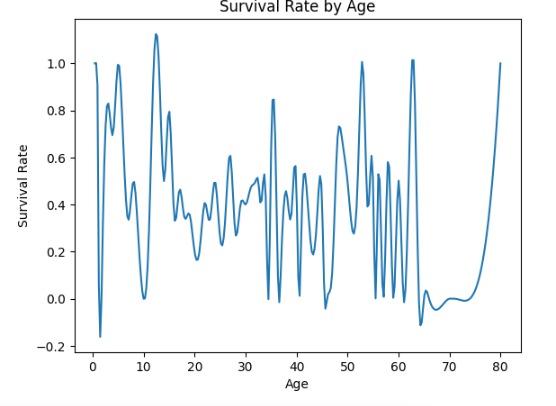
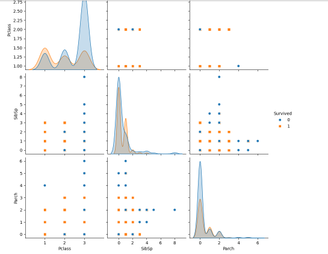
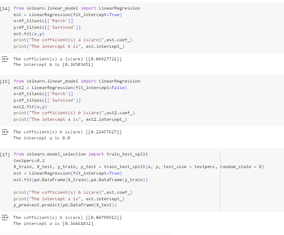

# TITANIC_Report 
- **Subject:HSB3119-Introduction to Data Science**
- **Class:MAS02**
- **Lecturer:Dr. Emmanuel Lance Christopher VI M. Plan**
- **Group 11:**      
Dang Nhat Minh - 22080328  
Ha Minh Tam -  22080342  
Dang Thi Hoang Yen- 22080347  
Truong Si Duy Anh - 22080300    
Vu Minh -  22080330  
## In our report, group 11 will summarize data and use machine learning to create a model that predicts which passengers survived the Titanic shipwreck by using data of train set and gender submisson
## I.Introduction
  
All the information of data included in Titanic on kaggle.com with the topic being data related to create a model that predicts which passengers survived the Titanic shipwreck.  
It contains two key tables that have been merged into one comprehensive dataset for analysis:
- **train.csv** :
For the training set, we provide the outcome (also known as the “ground truth”) for each passenger.
- **test.csv**:
For the test set, we do not provide the ground truth for each passenger.

## II.Data Discussion    
This data can be instrumental for analyzing sales performance, understanding customer preferences, and making informed business decisions.

Firstly, we describe data that provides summary statistics for all columns in the DataFrame  
Including their passenger ID, survival status, passenger class, name, sex, age, number of siblings or spouses aboard, number of parents or children aboard, ticket number, fare, cabin, and embarkation port.
  
   
Next, we define info data in order to show the structure and content of the data before further analysis.  
Data type: The dataset is a pandas DataFrame, which is a two-dimensional labeled data structure with columns of potentially different data types.
Dimensions: The dataset has 891 rows (entries) and 12 columns.
Column names and data types: The output lists each column name along with its corresponding data type. For example, the column PassengerId is of type int64, while the column Name is of type object.
Non-null counts: The output also indicates the number of non-null values in each column. This is important because missing values can affect data analysis.  
Memory usage: The output shows the total memory used by the dataset.  

This code removes duplicate rows from the Pandas DataFrame and specifies that the changes should be made directly to the existing DataFrame by inplace  
## III.Chart Explanations  
   
 In these chart we split 2 main index are age and survived to analyzes the survival rate by age group and age, and creates bar and line plots to visualize the results  
 When look at the bar chart we can see the survival rates generally decrease with age, with children having the highest survival rate and seniors having the lowest. However, there is a slight increase in survival rate for young adults compared to teenagers   
  We can see that the survival rate is highest for children, followed by teenagers, young adults, middle-aged adults, and seniors. The survival rate for children is about 0.6, while the survival rate for seniors is about 0.3. This suggests that children are more likely to survive than adults, and that the survival rate decreases with age.
 Move to linechart revealed that if the data for certain age groups is limited, the survival rate estimates might be less reliable and subject to greater variability
  
The plot suggests that passenger class is the most important factor influencing survival, with passengers in higher classes having a better chance of survival. The number of siblings or spouses and the number of parents or children do not appear to have a strong relationship with survival    
The regression shows a pair plot of the variables Pclass, SibSp, Parch, and Survived. The diagonal plots show the distribution of each variable, while the off-diagonal plots show the relationship between pairs of variables.  
  
Some observations that can be made from the plot include:  
The distribution of Pclass is skewed to the right, with most passengers being in the third class.  
The distribution of SibSp and Parch is also skewed to the right, with most passengers having no siblings or parents on board.  
The relationship between Pclass and Survived is somewhat negative, suggesting that passengers in lower classes were less likely to survive.  
The relationship between SibSp and Survived is also somewhat negative, suggesting that passengers with more siblings or parents on board were less likely to survive.  
The relationship between Parch and Survived is more complex, with no clear trend.  
  
The coefficient for Parch is positive in both models, indicating that having more parents or children on board is associated with a higher probability of survival.     
The intercept term is significant in the first model but not in the second model. This suggests that there is a baseline survival probability even when Parch is 0.    
The values of the coefficients and intercept vary slightly between the two models, likely due to the inclusion or exclusion of the intercept term.    
The predicted survival probabilities can be used to evaluate the model's performance on the testing data.    
The output of the code shows that the coefficient of the Parch variable is positive and significant, suggesting that having more parents and children on board is associated with a higher probability of survival.   
The intercept term is also positive and significant, suggesting that even passengers with no parents or children on board have a non-zero probability of survival.  

The code also shows that the intercept term is not significant when fit_intercept is set to False, suggesting that the intercept term is not necessary in this case.    

Overall, the code demonstrates how to perform linear regression analysis in Python using the sklearn library.

## IV.Conclusion  
The Titanic dataset provides valuable insights into the factors influencing survival in a disaster. By understanding these factors and leveraging machine learning techniques, we can develop models that can potentially aid in rescue efforts and improve outcomes in future disasters.
# Key Findings:
Through our analysis, we identified several significant factors that influenced survival on the Titanic:

Passenger Class: First-class passengers had a higher survival rate compared to second- and third-class passengers.
Gender: Women and children were prioritized in rescue efforts, resulting in a higher survival rate for females.
Age: Children had a higher survival rate than adults, likely due to the same prioritization.
Fare: Higher fares were associated with a higher survival rate, suggesting that first-class passengers had access to better accommodations and resources.
