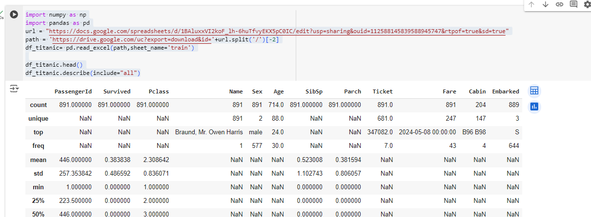
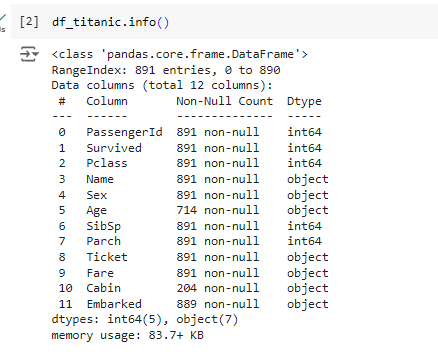
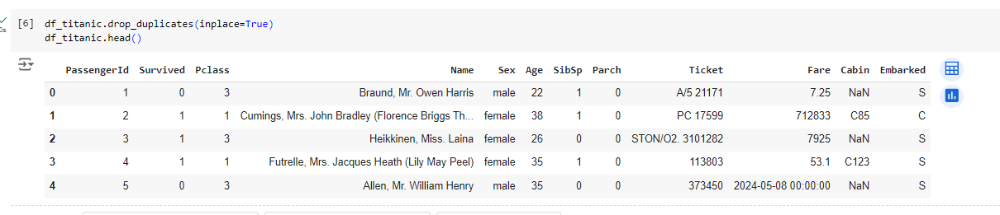

# titanic_report 
In our report, group 11 will summarize data and use machine learning to create a model that predicts which passengers survived the Titanic shipwreck by using data of train set and gender submisson
All the information of data included in kaggle.com

Firstly, we describe data that provides summary statistics for all columns in the DataFrame

Next, we define info data in order to show the structure and content of the data before further analysis.

This code removes duplicate rows from the Pandas DataFrame and specifies that the changes should be made directly to the existing DataFrame by inplace
