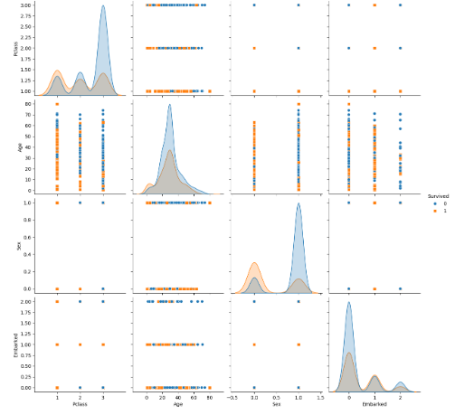
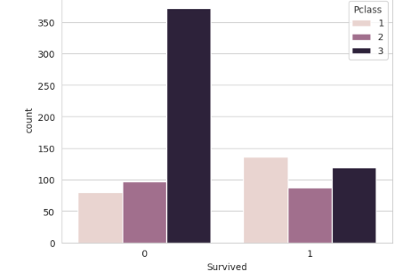

 TITANIC_Report 
- **Subject:HSB3119-Introduction to Data Science**
- **Class:MAS02**
- **Lecturer:Dr. Emmanuel Lance Christopher VI M. Plan**
- **Group 11 Report:⛴️ Titanic Shipwreck Incident**      
# `Sumary`
 This report aims to develop and compare two machine learning models - K-Nearest Neighbors and Logistic Regression - for predicting passenger survival on the Titanic. The models will utilize features such as Gender, Age, and Passenger Class to make predictions. The performance of both models will be evaluated and compared to a baseline model to determine their predictive accuracy.
 
## I.Introduction
- The tragic sinking of the Titanic in 1912, resulting in the loss of over 1500 lives, serves as a poignant reminder of the dangers of maritime travel. In the aftermath of this disaster, international regulations were implemented to improve ship safety. This report delves into the factors that may have influenced passenger survival on the Titanic. By employing machine learning techniques, specifically K-Nearest Neighbors and LOgistic Regression, we will analyze a dataset containing information about the passengers and crew. Through this analysis, we aim to uncover patterns and trends that may shed light on the determinants of survival and potentially inform future disaster response strategies.
  
It contains two key tables that have been merged into one comprehensive dataset for analysis:
- **train.csv** :
For the training set, we provide the outcome (also known as the “ground truth”) for each passenger.
- **test.csv**:
For the test set, we do not provide the ground truth for each passenger.

## II.Data Discussion    

- To construct our models, we selected four key independent variables: Sex, Age, Pclass, and Embarked. The target variable for our prediction is 'Survived'. These variables were chosen based on two primary considerations. First, we excluded variables with significant missing data, such as 'Cabin'. Second, we analyzed the correlation matrix and identified variables with high correlation or low predictive power, such as 'SibSp' and 'Fare'.

- The initial dataset contained several missing values, particularly in the 'Age' column. To handle these missing values, we employed a simple imputation technique, replacing the missing values with the mean age. While more sophisticated imputation methods exist, this approach was deemed sufficient for our purposes. For the 'Embarked' column, we removed the two rows with missing values as they represented a minimal portion of the dataset. To prepare the categorical variables 'Sex' and 'Embarked' for machine learning models, we converted them into numerical representations using label encoding.

  
### Data Visualize
  `Bar chart about Survial Rate in Pclass :`

  
   

- Class 1 passengers had the highest survival rate: This is likely due to factors such as having access to better accommodations, being located on higher decks, and potentially having more resources to aid in evacuation.
- Class 3 passengers had the lowest survival rate. This could be attributed to factors like being located on lower decks, having limited access to lifeboats, and facing challenges in evacuation procedures.

`Histogram about Distribution of Passenger Ages :`

- This histogram provides a visual representation of the age distribution of the passengers on the Titanic, highlighting the prevalence of younger passengers and the presence of a few older individuals.

  ### Models Listing :
  For this project, two models Logistic Regression model and K nearest neighbor were selected
  Before using this model, we need to visualize the model through pair plot
  
   
  
## III.Models Resulting :
`Logistic Regression`

   
- Both false positive and false negative predictions can have significant consequences. A false positive, where a person is predicted to be alive but is actually deceased, can lead to unnecessary expenditure on rescue efforts.

 
- Look over the chart we can see that female have higher percentage of alive than men, the death number in men are almost 400

  
-  The AUC score of 0.88 indicates that the model has a good ability to distinguish between positive and negative classes. A higher AUC value signifies better performance.

  `KNN`
  
 

 
 

- The KNN model demonstrated superior performance in recognizing negative values, as evidenced by its higher specificity. It also exhibited greater accuracy in predicting positive values. However, the logistic regression model proved more effective in minimizing false negatives, as indicated by its higher recall. When considering both precision and recall, the F1-score favored the logistic regression model, suggesting a more balanced performance. Overall, while KNN achieved slightly higher accuracy, the logistic regression model offered a more robust and reliable classification.

## V.Conclusion  
- The feature importance analysis revealed that Sex and Pclass were the most influential factors in the logistic model. This aligns with the expectation that women and higher-class passengers were prioritized during the evacuation. In contrast, Age and Embarked exhibited weaker relationships with survival, as evidenced by the similar distributions observed in the FacetGrid analysis.

- To improve model accuracy, addressing the significant amount of missing data (approximately 20%) is crucial. This issue could potentially explain the low coefficient for Age. Additionally, the limited number of relevant features in the dataset may contribute to underfitting, hindering the model's ability to capture complex patterns.
Age: Children had a higher survival rate than adults, likely due to the same prioritization.
Fare: Higher fares were associated with a higher survival rate, suggesting that first-class passengers had access to better accommodations and resources.

## VI.References
                                                                    TEAM EVALUATION
                                                                    
| Student Number | Student Name        | Task Done                                                                                                                                                          | Remarks by Leader (if any)          | Student Evaluation |
|----------------|---------------------|--------------------------------------------------------------------------------------------------------------------------------------------------------------------|-------------------------------------|---------------------|
| 22080337       | Đặng Nhật Minh     | Do 2 chart Machine Learning, writing report, supervised other tasks and comment to chart "Machine Learning"                                                                     |                                     | 100%               |
| 22080331       | Đặng Thị Hoàng Yến      | Do distribution 1 Machine Learning, slide |      | 90%               |
| 22080324       | Hà Minh Tâm     | KNN model and writing report                                                                                              |                                     | 100%                |
| 22080294       | Vũ Minh         | Cleaning data                                                                                             |                                     | 90%                |
| 22080304       | Trương Sĩ Duy Anh      | 2 charts for visualizing data                                                                                                |                                     | 90%                |
