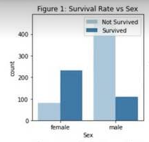
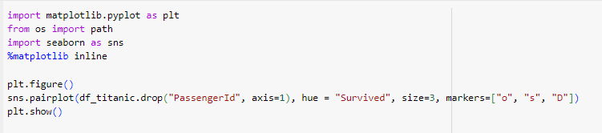

# TITANIC_Report 
## In our report, group 11 will summarize data and use machine learning to create a model that predicts which passengers survived the Titanic shipwreck by using data of train set and gender submisson
All the information of data included in kaggle.com

Firstly, we describe data that provides summary statistics for all columns in the DataFrame
  
Next, we define info data in order to show the structure and content of the data before further analysis.

This code removes duplicate rows from the Pandas DataFrame and specifies that the changes should be made directly to the existing DataFrame by inplace
    
 In these chart we split 2 main index are age and survived to analyzes the survival rate by age group and age, and creates bar and line plots to visualize the results  
 When look at the bar chart we can see the survival rates generally decrease with age, with children having the highest survival rate and seniors having the lowest. However, there is a slight increase in survival rate for young adults compared to teenagers  
 Move to linechart revealed that if the data for certain age groups is limited, the survival rate estimates might be less reliable and subject to greater variability
   
The plot suggests that passenger class is the most important factor influencing survival, with passengers in higher classes having a better chance of survival. The number of siblings or spouses and the number of parents or children do not appear to have a strong relationship with survival

The coefficient for Parch is positive in both models, indicating that having more parents or children on board is associated with a higher probability of survival.   
The intercept term is significant in the first model but not in the second model. This suggests that there is a baseline survival probability even when Parch is 0.  
The values of the coefficients and intercept vary slightly between the two models, likely due to the inclusion or exclusion of the intercept term.  
The predicted survival probabilities can be used to evaluate the model's performance on the testing data.
